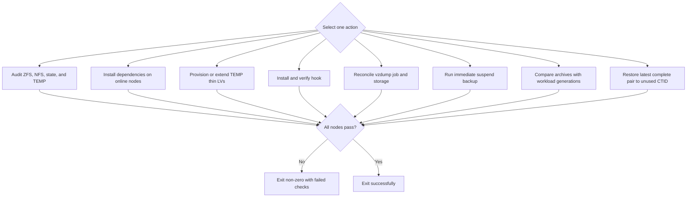

# backupCT.sh

Audits, installs, configures, runs, verifies, and restore-tests the cluster's
workload-aware Proxmox backup subsystem.

## Usage

```bash
./backupCT.sh ACTION [options]
```

| Action | Purpose |
| --- | --- |
| `--audit` | Check snapshot and NFS capabilities on every online node |
| `--install-prerequisites` | Install package-backed hook dependencies |
| `--provision-temp` | Reconcile dedicated suspend-mode TEMP storage |
| `--install-hook` | Install the hook, shared policy, and backup job reconciler |
| `--configure-job` | Reconcile the cluster vzdump job |
| `--run <CTID\|hostname\|all>` | Run an immediate suspend backup |
| `--verify` | Report archive/workload pair completeness |
| `--cleanup-stale` | Remove interrupted archive and workload temporary directories |
| `--restore-test <CT>` | Restore the newest complete pair in isolation |

`--restore-test` automatically allocates the next unused cluster ID and accepts
`--restore-id <unused-CTID>` as an explicit override. `--node` defaults to the
source CT's node. `--force` skips restore confirmation.
For `--cleanup-stale`, `--force` bypasses only the 24-hour age guard. Mutating
actions support `--dry-run`.

## Initial setup

Run setup in this order from one Proxmox host:

```bash
./backupCT.sh --install-prerequisites
./backupCT.sh --provision-temp
./backupCT.sh --install-hook
./backupCT.sh --audit
./backupCT.sh --configure-job
./backupCT.sh --verify
```

The job is not enabled until its audit passes. Backup policy, NFS storage,
source datasets, TEMP sizing, retention, and job schedule come from
`commonCT.json`.

`--audit`, `--verify`, and `--run` verify that the installed workload hook,
policy, and backup-health library match the repository sources. If any node has
drifted, run `--install-hook` before starting another backup. This prevents an
older hook with unbounded rsync progress output from re-entering the task-log
backpressure failure mode.

The installed 15-minute reconciler timer uses leader election to refresh exact
CT and QEMU VMID lists. This enrolls resources created directly through
Proxmox. It updates existing jobs only; create the separate VM job with
`backupVM.sh --configure-job`.
The same reconciliation also applies one shared retention policy to both jobs.
CT configuration audits NFS backup storage on every online node; VM
configuration independently requires that storage to be active on every online
node.

## Flow



## Routine operations

Run a full immediate backup and verify exact archive/workload pairs:

```bash
./backupCT.sh --run all
./backupCT.sh --verify
```

Run a periodic restore test with an automatically allocated CTID:

```bash
./backupCT.sh --restore-test <source-CT>
```

The restore test uses the newest complete pair and requires explicit confirmation
unless forced. Before restoring, it selects a bridge using the new restore CTID,
the restored hostname, and the restore node's `entities:` policy. Every restored
NIC uses that bridge and is forced to `link_down=1` while unrelated fields are
preserved. Remove the isolated test CT after validation with `deleteCT.sh`.

Inspect stale interrupted backup artifacts without deleting them:

```bash
./backupCT.sh --cleanup-stale --dry-run
```

The cleanup refuses to proceed if `vzdump` is active on any online node or if a
node cannot be checked. By default, only exact-pattern real directories at least
24 hours old are candidates. After inspecting Proxmox task logs, remove newer
known-abandoned artifacts with the same safeguards:

```bash
./backupCT.sh --cleanup-stale --force --dry-run
./backupCT.sh --cleanup-stale --force
```

## Failure handling

Do not treat an apparently quiet terminal as proof that backup work stopped.
Check the Proxmox task and hook state first. Hook output is deliberately bounded
to prevent terminal backpressure from blocking task completion.

After interruption, rerun `--audit` before `--run`. The next backup job
reconciles validated stale hook state, pending snapshots, and exact-pattern
temporary artifacts older than 24 hours. Unknown and recent artifacts are
retained for inspection. `--provision-temp` grows undersized staging storage but
never shrinks it. Use `--verify` after every manual run and after recovery.

A Proxmox `lock: backup` is separate from hook state and temporary artifacts.
Audit, verification, and the periodic job reconciler report an idle backup lock
as stale only after the newest complete pair exceeds 26 hours. Detection is
read-only and never unlocks a CT. Before recovery, inspect active Proxmox tasks
and host processes on the CT's owner node. Only after proving that no backup
owns the lock, clear it with `pct unlock <CTID>`, rerun `--audit`, back up that
CT immediately, and finish with `--verify`. Do not edit the CT configuration or
use `--cleanup-stale` as a substitute for clearing a confirmed stale Proxmox
lock.

## Related

- [Backup design](documentation/backup-design.md)
- [VM backup guide](backupVM.md)
- [Backup helpers](backup/README.md)
- [Troubleshooting](documentation/troubleshooting.md)
- [Delete](deleteCT.md)
