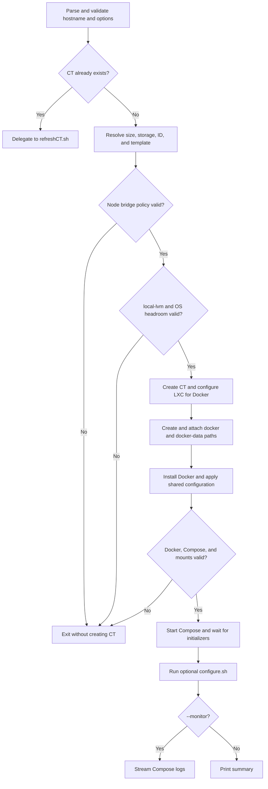

# createCT.sh

Creates an Alpine LXC container, installs Docker, mounts the per-host storage,
applies shared configuration, and starts its Compose workload.

## Usage

```bash
./createCT.sh <hostname> [--size S|M|L] [--cores N] [--memory MB]
  [--priority low|mid|high] [--vlan ID] [--monitor] [KEY=value ...]
```

Examples:

```bash
./createCT.sh app.thesaints.home --size M
./createCT.sh app.thesaints.home --cores 3 --memory 3072 --priority high
./createCT.sh app.thesaints.home --vlan 100 IP=10.0.0.50/24 GW=10.0.0.1
```

Named size defaults come from `commonCT.json`; explicit cores or memory override
the selected base. Common key/value overrides include `CTID`, `DISK`, `IP`,
`GW`, and `TEMPLATE_PREFIX`. `BRIDGE` overrides are rejected: creation selects
the bridge from the local node's `entities:` policy after the CTID and hostname
are final. Rootfs storage is fixed to `local-lvm`;
`STORAGE` overrides are rejected.

## Flow



## Preconditions and effects

Run as root on a Proxmox host. The hostname's domain, selected size, SSL policy,
and required integrations must be valid in `commonCT.json`. The node-local
`local-lvm` storage must be an active `pve/data` LVM thin pool with `rootdir`
content. Creation fails before allocating a volume when projected thin-volume
commitments would leave less than 20% of the pool free, thin-pool metadata usage
is at least 80%, or the separate Proxmox `/` filesystem has less than 20% free.

`local-lvm` and the Proxmox OS filesystem are separate logical volumes on the
same system disk. CT rootfs allocation consumes `pve/data`, not `pve/root`.
The ZFS `DATA` pool remains required behind the `DOCKER` directory storage for
the `/mnt/docker` tree; only rootfs allocation has moved away from `DATA`.

The script creates the CT rootfs on `local-lvm`, creates `/mnt/docker/<hostname>`
and `/mnt/docker-data/<hostname>`, and reconciles exactly three bind mounts:
node-local IMDS at read-only `mp0`, Docker at `mp1`, and Docker-data at `mp2`.
It writes the CT `.env` and uses the matching fallback Compose template when no
per-CT Compose file exists. An existing CT is refreshed instead of duplicated.

Profile-aware stacks put grouped `x-profiles` metadata first in their Compose
file. Creation installs Python/PyYAML, validates that metadata, evaluates its
requirements inside the CT, and reevaluates selection on boot. Selection is
process-local; node and device identity are never persisted in `.env`. Existing
`_config/select-compose-profile.sh` workloads remain supported during migration.

## Recovery

Creation validates major boundaries but is not a transaction with automatic
container deletion. If it fails, read the last completed phase, fix the reported
storage, package, mount, Compose, initializer, or configure error, then rerun the
same command. Idempotent shared configuration and existing-CT delegation make
that the normal recovery path.

## Related

- [Refresh](refreshCT.md)
- [Delete](deleteCT.md)
- [Configuration](documentation/configuration.md)
- [Architecture](documentation/architecture.md)
