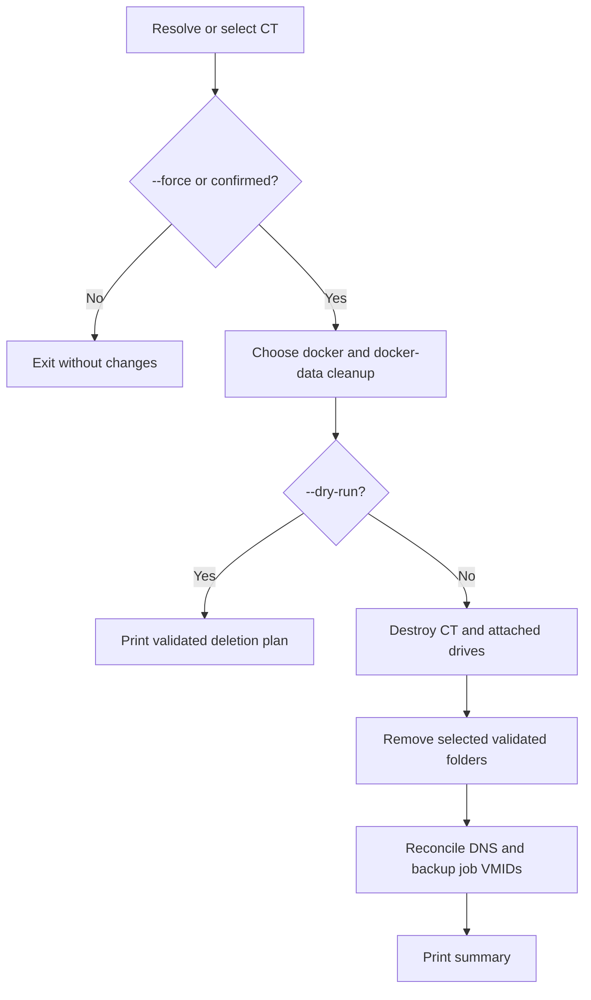

# deleteCT.sh

Destroys a CT and optionally removes its host-side Docker configuration and data
directories.

## Usage

```bash
./deleteCT.sh [CTID|hostname] [--force] [--dry-run]
```

```bash
./deleteCT.sh app.thesaints.home --dry-run
./deleteCT.sh 2100
./deleteCT.sh 2100 --force
```

Without a CT argument, an interactive selector is shown. `--force` skips all
prompts and selects both related folders for deletion. Use `--dry-run` before an
unattended or forced deletion.

## Flow



## Safety and effects

Run as root on a Proxmox host. The script resolves exactly one CT, validates
cleanup paths against the expected canonical paths, and refuses symlinks or path
drift. Folder cleanup targets only `/mnt/docker/<hostname>` and
`/mnt/docker-data/<hostname>`.

CT destruction includes attached drives and is irreversible. Folder removal is
also irreversible unless an independent backup exists. After deletion, the
script refreshes DNS state and removes the deleted CT from the configured backup
job.

## Recovery

There is no automatic rollback after `pct destroy`. If folder cleanup or
reconciliation fails after CT destruction, inspect the remaining paths, run the
split-DNS reconciliation as needed, and rerun backup job configuration. Restore
service state from a verified backup rather than recreating data manually.

## Related

- [Create](createCT.md)
- [Backup](backupCT.md)
- [Forward DNS](forwardDNSCT.md)
- [Troubleshooting](documentation/troubleshooting.md)
