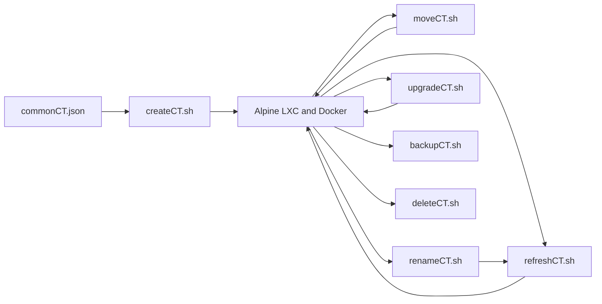
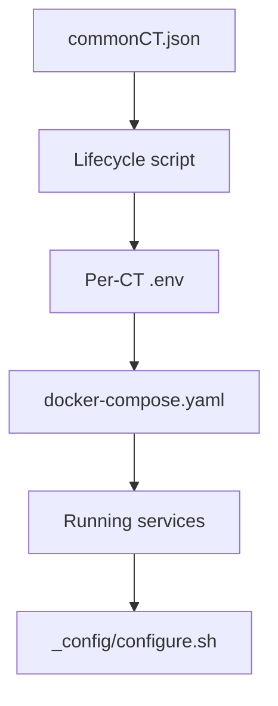

# Architecture

This repository manages Docker workloads inside Alpine Linux LXC containers on a
Proxmox cluster. The top-level lifecycle scripts run on a Proxmox host and share
idempotent infrastructure functions from `../commonCT.sh`.

## Lifecycle model



The scripts separate orchestration from reusable behavior:

- Top-level scripts parse operator intent, select containers, and order work.
- `commonCT.sh` owns shared Proxmox, Docker, storage, DNS, and configuration
  functions, including node-local bridge-policy selection and all-NIC
  reconciliation.
- `configure/` contains POSIX shell libraries delivered into containers for
  post-deployment application configuration.
- `compose/` contains domain-specific Compose templates used when a container
  does not yet have its own Compose file.
- `containers/` contains source for custom Caddy images.

## Execution boundaries

Commands issued by these scripts run on the Proxmox host unless a shared helper
explicitly enters a container with `pct exec`. Host paths include the container
hostname, for example `/mnt/docker/<hostname>`. Inside a container, the same bind
mount is `/mnt/docker` and must not repeat the hostname.

```mermaid
flowchart LR
    Host[Proxmox host] -->|pct exec CTID| Guest[LXC container]
    HostDocker[/mnt/docker/hostname] -->|mp0| GuestDocker[/mnt/docker]
    HostData[/mnt/docker-data/hostname] -->|mp1| GuestData[/mnt/docker-data]
```

## Configuration flow

`commonCT.json` is the cluster-level source of truth. Lifecycle scripts derive a
per-container `.env`, Docker Compose consumes that environment, and an optional
`_config/configure.sh` performs idempotent API-level setup after the workload is
running.



The host-side `configure/lib-*.sh` files are the source of truth for shared
configure helpers. They are mirrored to `/mnt/docker/_config/shared/` inside a
container before `configure.sh` runs; delivered copies must not be edited.

## Reliability model

Configuration functions are designed to be safe to run repeatedly. Operations
that cannot be naturally idempotent use explicit validation, snapshots, or
rollback:

- `refreshCT.sh` re-applies desired state and retries bounded startup failures.
- Runtime lifecycle paths fail closed on bridge policy, reconcile drift before
  later mutations, and retain a policy-correct assignment if unrelated work
  subsequently fails.
- `moveCT.sh` validates and synchronizes before committing a migration, then
  rolls back when target verification fails.
- It persists a restartable phase transaction and the native Proxmox migration
  UPID. Proxmox owns the node-executed migration task; the script is a
  resumable coordinator for bind-data sync, mount restoration, and application
  validation, not a resident system service.
- `upgradeCT.sh` creates a rollback point before changing Alpine releases.
- `backupCT.sh` records hook state and treats the final workload generation
  directory as a completion marker.
- `deleteCT.sh` validates paths and confirmations but is intentionally
  irreversible once destruction begins.

Finite top-level lifecycle scripts mirror stdout and stderr to
`/root/scripts/logs/<script>.log`. Each invocation replaces that script's prior
log, so the directory records the latest run on that Proxmox node rather than a
history. The directory is mode `0700`, files are mode `0600`, and known
sensitive command-line option values are redacted. `monitorCT.sh` is an
unbounded stream and is intentionally excluded; create and refresh close their
finite log before handing control to it.

Logging records a run but does not detach it from the terminal. An SSH
disconnect can still terminate a lifecycle process unless the operator uses a
session manager or another appropriate host-side execution mechanism.

## Related documentation

- [Documentation index](README.md)
- [Configuration](configuration.md)
- [Storage and permissions](storage-and-permissions.md)
- [Networking and authentication](networking-and-authentication.md)
- [Testing](testing.md)
- [Troubleshooting](troubleshooting.md)
