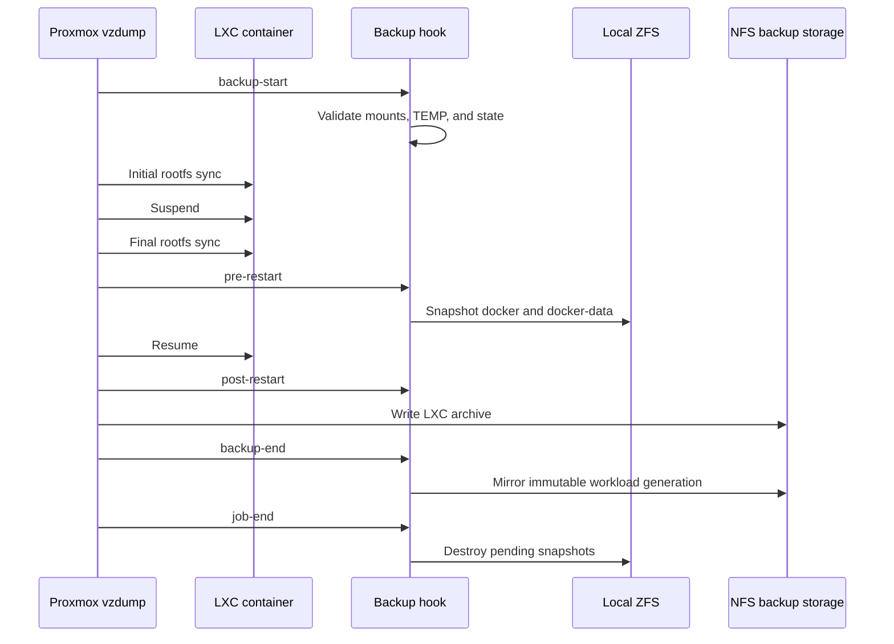
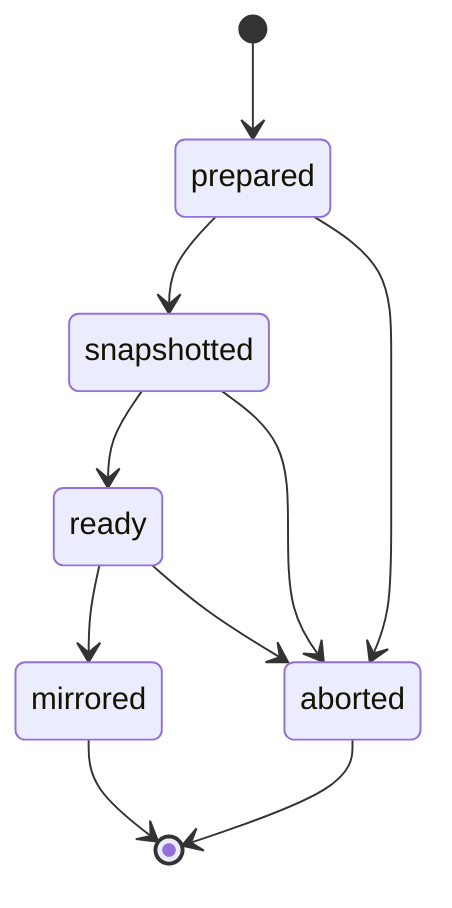

# Backup Design

The workload-aware backup path pairs each normal Proxmox LXC archive with immutable copies
of that CT's host-side `/mnt/docker/<hostname>` and
`/mnt/docker-data/<hostname>` trees. The [backup guide](../backupCT.md) owns CLI
procedures; this document owns consistency, storage, and failure decisions.

QEMU VMs use a separate native snapshot path managed by
[backupVM.sh](../backupVM.md). Their `.vma.zst` archives do not use the LXC
workload hook or node-local `/TEMP` staging.

## Selection reconciliation

The CT and QEMU jobs use separate, exact VMID lists generated from cluster
resources. Shared exclusion tags omit administrative exceptions and isolated
restore tests. A systemd timer runs the reconciler on every node every 15
minutes; only the lexically first online node performs writes. This makes
enrollment converge after direct Proxmox resource creation without attaching a
selection hook to an already-started backup job.

The reconciler updates existing jobs and disables a job when its eligible set
is empty. Initial job creation and full schedule, storage, retention, and mode
configuration remain explicit operations in `backupCT.sh` and `backupVM.sh`.
It also reasserts the same shared prune policy on both jobs to repair retention
drift. CT audits exercise NFS capabilities on every online node, while QEMU job
configuration requires the backup storage API to report active on every online
node.

## Consistency flow



The two ZFS snapshots are created sequentially while the CT is suspended. The
window is tightly bounded but is not mathematically atomic across two datasets.
No recursive traversal or network copy occurs while the guest is frozen.

## Completion and retention

The storage layout is:

```text
<backup-mount>/
├── dump/vzdump-lxc-<CTID>-<timestamp>.tar.zst
├── dump/vzdump-lxc-<CTID>-<timestamp>.tmp
└── workloads/<hostname>/vzdump-lxc-<CTID>-<timestamp>/
    ├── docker/
    └── docker-data/
```

A final workload directory containing both trees is the completion marker.
Proxmox may create the `dump/*.tmp` directory while publishing an archive. The
hook builds each workload mirror as
`workloads/<hostname>/.tmp-vzdump-lxc-<CTID>-<timestamp>-<PID>` before atomically
renaming it to the final generation. Neither temporary form is a valid backup;
persistent instances indicate interrupted work. Temporary generations are never
incremental bases.
Later generations use `rsync --link-dest` against the newest complete matching
generation. Unchanged files share inodes; changed files are copied. Completed
generations are never modified.

Proxmox owns archive retention. At `job-end`, the hook removes only complete
workload generations whose exact archive no longer exists.

## Storage contracts

The source mountpoints must be ZFS datasets with configured snapshot headroom.
The destination must be active shared NFS backup storage supporting hard links,
atomic rename, and numeric ownership preservation. A root-squashed export cannot
meet the ownership guarantee.

Suspend-mode rootfs staging uses a dedicated node-local ext4 thin LV mounted at
`/TEMP`. Its block-device capacity must be at least the configured multiplier
times the largest production CT rootfs. Filesystem metadata overhead must not
cause a correctly sized device to fail validation, so the hook checks device
capacity rather than `df` filesystem size.

## State and recovery

Root-only state under `/var/lib/pve-workload-backup` records CT ID, hostname,
generation, phase, and pending snapshots. The normal phase progression is:



Abort phases remove known snapshots and incomplete remote generations. The next
`job-init` reconciles only validated state whose snapshot names match that CT's
pending-generation pattern. Unknown state remains for manual inspection.

Exact-pattern archive staging and workload mirror directories older than 24
hours are removed during `job-init`. Recent, malformed, nested, file, and symlink
entries are retained. Node audit reports stale artifacts as failures. Operators
can use `backupCT.sh --cleanup-stale --dry-run` for a candidate list; forced
cleanup bypasses the age threshold only after confirming every online node has
no active `vzdump` process.

NFS capability probes use `.workload-backup-probe.*` directories. Normal runs
remove them immediately; probes older than one hour are considered interrupted
and are removed during reconciliation.

## Bounded logging decision

The workload mirror uses `rsync --info=stats1` without `progress2`. Per-file
progress generated thousands of hook log records during a large generation.
Proxmox relayed those records to the invoking terminal; terminal backpressure
blocked the task writer and made an already-completed backup appear frozen.
Bounded summary output preserves diagnostics without allowing terminal output to
become part of the backup's liveness path.

The repository source and the installed hook are separate artifacts. Audit,
verification, and manual CT backup preflights compare the installed hook,
policy, and health library with their repository sources. Drift is fatal and
must be repaired explicitly by reinstalling the hook on every online node.

## Backup-lock health

Proxmox owns the CT configuration `lock: backup`; the workload hook does not.
Health checks are therefore read-only. A backup lock is reported as stale only
when its owner node has no active `vzdump` task and the newest complete
archive/workload pair is older than 26 hours (or no complete pair exists). An
active task suppresses stale classification, and recent pairs receive a grace
period. Non-backup locks are outside this check.

The elected job reconciler performs this check after membership and retention
reconciliation. A stale lock makes the unit fail visibly without rolling back
job reconciliation and without calling `pct unlock`. Unlocking remains an
operator decision after task and process ownership have been inspected.

## Related documentation

- [Backup operator guide](../backupCT.md)
- [VM backup operator guide](../backupVM.md)
- [Backup helper folder](../backup/README.md)
- [Storage and permissions](storage-and-permissions.md)
- [Troubleshooting](troubleshooting.md)
