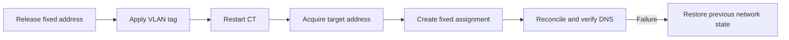

# Networking and Authentication

Network identity is coordinated across Proxmox, the network controller, DNS,
Caddy, and Authentik. Lifecycle scripts order these updates so a container is
reachable before application-level configuration runs.

## Container networking

### Deterministic bridge policy

Runtime lifecycle operations derive a guest's bridge from the Linux bridge
comments on the node where it runs or will run. The authoritative source is
that node's `/etc/network/interfaces`; only `vmbr<number>` interface stanzas are
eligible. Put a standalone, case-insensitive `entities:` label in the bridge
comment. Descriptive prefixes are allowed:

```text
# Management & Entities: 3500, seafile.thesaints.de
auto vmbr1
iface vmbr1 inet manual

# Workloads — Entities: CT VM
auto vmbr2
iface vmbr2 inet manual

# Entities: *
auto vmbr10
iface vmbr10 inet manual
```

Values after the label are comma- or whitespace-separated exact tokens. The
precedence is exact numeric ID or hostname/name, then exact `CT` or `VM`, then
the literal wildcard `*`. ID and hostname have the same highest rank. If more
than one bridge matches at the winning rank, the lowest numeric suffix wins,
so `vmbr2` precedes `vmbr10`.

The entire remainder of the comment line is the entity list; do not append
prose after it. `NonEntities:` is not a label. Duplicate labels, invalid tokens,
an absent match, or a selected bridge missing from `/sys/class/net/<bridge>/bridge`
fail closed before destructive work.

One selected bridge applies to every `netN` device of the CT or VM. The scripts
replace only `bridge=` and preserve MAC/model, VLAN, trunks, firewall, MTU,
rate, link state, and unknown fields. Restore tests additionally force
`link_down=1`. There is no `BRIDGE` command or environment override; temporary
exceptions belong in the node policy. Create, refresh, rename, upgrade, move,
and CT/VM restore-test paths enforce this contract.

### VLAN changes

Containers may also carry a VLAN tag. A VLAN change is a
transaction: release the previous fixed address, change the tag, restart the CT,
acquire an address on the target network, and re-pin that address. Failures
trigger a best-effort rollback to the previous network state.



The primary configured domain uses direct local records. Secondary domains are
served through the split-DNS workflow managed by `forwardDNSCT.sh` and the
configured CoreDNS service.

## Reverse proxy identity

Every Compose service has an explicit `container_name`. The canonical telemetry
identity is `<hostname>/<container_name>` across logs, metrics, and traces. Caddy
uses Compose labels to expose selected services and obtains certificates from
the domain's configured issuer.

## Authentik

Authentik is the central authentication provider. Forward authentication is
managed only by `forwardAuthCT.sh`; native OIDC registration is performed by a
CT's idempotent `configure.sh` through the shared configure libraries.

API-created OIDC providers require explicit values that the Authentik UI would
normally supply:

- `grant_types`, normally including `authorization_code`.
- `redirect_uris` as objects with matching mode and URL.
- `property_mappings` for required scopes such as `openid`, `email`, and
  `profile`.
- Resolved authorization and invalidation flow identifiers.

Existing providers are patched to reassert required values and repair drift.
Use product-agnostic `AUTH_*` values from the CT `.env`; do not embed tokens or
live host values in documentation or Compose files.

Forward-auth labels use ordered Caddy route bands so the Authentik outpost,
authentication gate, and application handler execute predictably. The forwarded
host must remain the original request host for correct cookie scoping.

## Related documentation

- [Configuration](configuration.md)
- [Architecture](architecture.md)
- [Forward-auth guide](../forwardAuthCT.md)
- [Split-DNS guide](../forwardDNSCT.md)
- [Refresh guide](../refreshCT.md)
