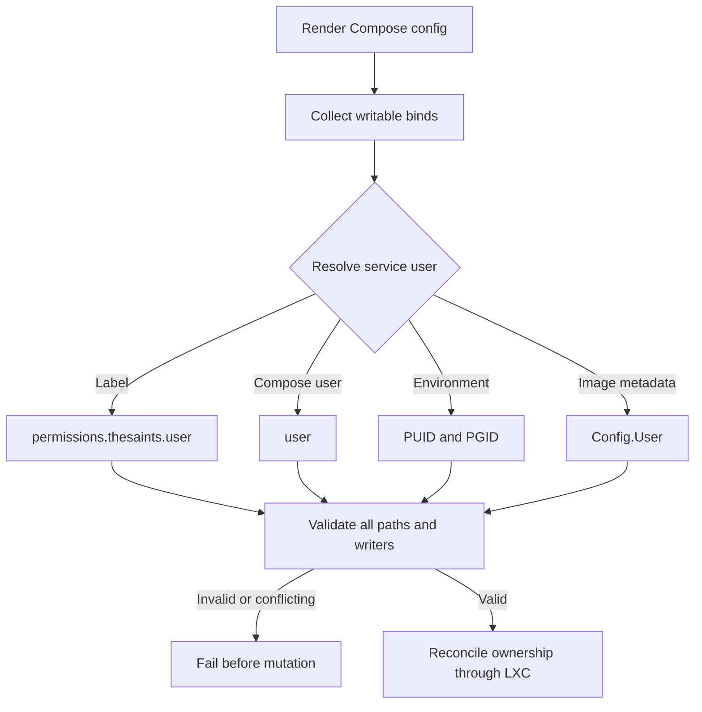

# Storage and Permissions

Lifecycle scripts manage storage across the Proxmox host, LXC mount points, and
Docker bind mounts. Path validation and ownership reconciliation are fail-closed
because mistakes at this boundary can affect unrelated workloads.

## Storage layout

| Storage | CT path | Intended use |
| --- | --- | --- |
| `local-lvm` (`pve/data`) | `/` | CT rootfs on the node's system disk |
| `/run/pve-imds/<CTID>` | `/mnt/pve-imds` | Read-only node-local instance metadata |
| `DATA`-backed `/mnt/docker/<hostname>` (`DOCKER`) | `/mnt/docker` | SSD-backed configuration and low-volume state |
| `/mnt/docker-data/<hostname>` | `/mnt/docker-data` | HDD-backed media, recordings, backups, and large data |

Lifecycle reconciliation assigns these bind mounts to `mp0`, `mp1`, and `mp2`
respectively. A successful reconciliation deletes every other `mpN` entry;
transaction rollback restores the exact original mount set and running state.
Missing IMDS health or source data warns but does not block reconciliation,
while mount configuration and CT restart failures remain fatal.

The ZFS `DATA` pool remains required as the home of the `/mnt/docker` directory
tree exposed through the `DOCKER` Proxmox directory storage. It is not a
supported CT rootfs target. The similarly named `pve/data` is a different
device: it is the LVM thin pool exposed by Proxmox as `local-lvm`.
Rootfs creation and cross-node moves require projected thin-volume commitments
to remain below 80% of `pve/data`. They also require at least 20% free on the
separate Proxmox OS filesystem, but CT rootfs sizes are not charged against that
filesystem.

Compose bind sources use CT-local paths and therefore never include the
hostname. Caddy configuration and certificates remain below `/mnt/docker/caddy`
for fast I/O.

## Permission reconciliation

`reconcile_compose_permissions` renders Compose configuration, identifies
writable bind mounts, resolves the effective service user, validates the entire
plan, and only then mutates ownership.

Resolution precedence is:

1. `permissions.thesaints.user` label.
2. Compose `user:`.
3. Paired `PUID` and `PGID`.
4. Image `Config.User` metadata.

Shared writable sources are accepted only when all writers resolve to the same
UID and GID. Unsafe, ambiguous, overlapping, or conflicting paths abort startup.

## Permission metadata

- `permissions.thesaints.recursive: "false"` owns only the mount root.
- `permissions.thesaints.skip` lists exact managed paths left under application
  control.
- Most services require neither setting because image or Compose metadata is
  sufficient.

File-backed Compose secrets live below `/mnt/docker/_secrets/`. The parent is
kept root-only at mode `0700`; explicitly mounted secret files are exposed
read-only at mode `0444`. Raw env files are read by CT-root Compose and are kept
CT-root-owned at mode `0400`.

Permission reconciliation owns only filesystem metadata derived generically from
Compose. Raw secret contents remain operator-managed workload state: lifecycle
operations preserve existing files and never generate, rotate, validate, or
repair their values. Missing or malformed workload secrets must be handled using
the workload's documented operator procedure.

## Backup staging

Backup staging uses the managed `/dev/<vg>/<lv>` block device mounted at `/TEMP`
and `/TEMP/vzdump-tmp` mode `1777`. Its virtual device capacity must be at least
the largest production CT rootfs multiplied by the configured staging factor.
Validation uses block-device size rather than ext4's smaller post-format usable
capacity. See [Backup design](backup-design.md).

## Related documentation

- [Architecture](architecture.md)
- [Configuration](configuration.md)
- [Troubleshooting](troubleshooting.md)
- [Refresh guide](../refreshCT.md)
