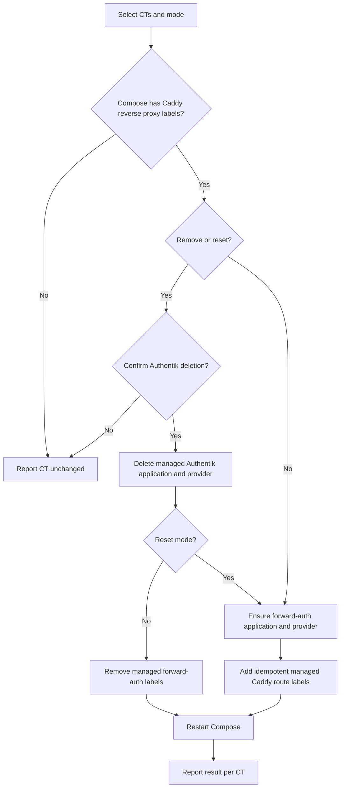

# forwardAuthCT.sh

Enables, removes, or resets Authentik forward authentication for Caddy-exposed
services in one or more CTs.

## Usage

```bash
./forwardAuthCT.sh [CTID|hostname]
./forwardAuthCT.sh [CTID|hostname] --remove
./forwardAuthCT.sh [CTID|hostname] --reset
```

Without a CT, the script opens a multi-select dialog. Enable is the default.
`--remove` deletes the per-host Authentik application/provider after
confirmation and strips managed Caddy labels. `--reset` deletes and recreates the
Authentik objects, which is useful when a stale native-OIDC object shares the
slug.

## Flow



## Preconditions and effects

Run as root on a Proxmox host. Authentik settings must be configured in
`commonCT.json`, selected CTs must be running, and target Compose services need a
`caddy.reverse_proxy` label.

The script manages only its known Caddy route labels and the matching per-host
Authentik objects. It references `${AUTH_HOSTNAME}` in Compose so the CT `.env`
remains the source of truth and renames do not hard-code the authentication
host. Compose is restarted after a change.

## Recovery

The operations are idempotent. If Authentik succeeds but Compose restart fails,
fix the Compose or service error and rerun the same mode. Before removing or
resetting, confirm that the per-host Authentik slug is not intentionally owned by
a native OIDC integration.

## Related

- [Networking and authentication](documentation/networking-and-authentication.md)
- [Configuration](documentation/configuration.md)
- [Refresh](refreshCT.md)
