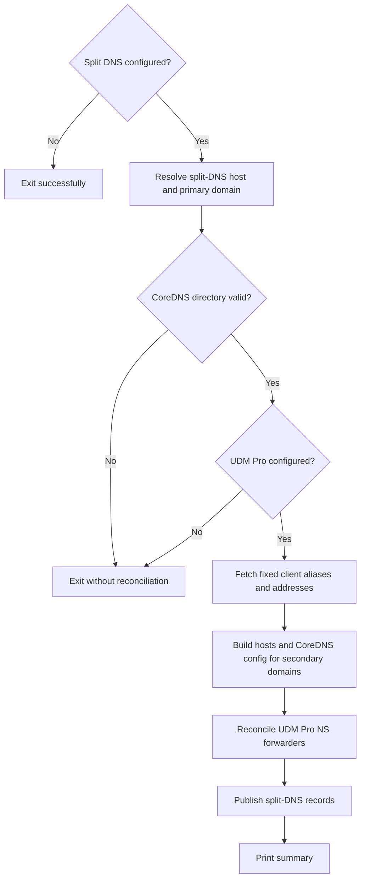

# forwardDNSCT.sh

Refreshes secondary-domain CoreDNS mappings and reconciles UDM Pro static NS
forwarders from fixed client aliases and addresses.

## Usage

```bash
./forwardDNSCT.sh
```

The command has no mutation options. `-h` or `--help` prints its description.
When split DNS is not configured, it reports a skip and exits successfully.

## Flow



## Ownership and effects

The first configured domain is primary and is not managed by this script.
For every other domain, the script derives host records from UDM Pro client data,
writes the split-DNS service's CoreDNS files, and reconciles network-controller
forwarders to that service.

Run as root on a Proxmox host. The split-DNS hostname, domain list, UDM Pro
connection, and the target CoreDNS directory must be configured and reachable.
The operation is idempotent and may be rerun after client alias, address, or
domain changes.

## Recovery

A failure leaves the previous published configuration available but may occur
between CoreDNS and forwarder reconciliation. Fix connectivity or configuration
and rerun the entire command. Verify both a secondary-domain lookup and its UDM
Pro forwarding rule before considering recovery complete.

## Related

- [Networking and authentication](documentation/networking-and-authentication.md)
- [Rename](renameCT.md)
- [Delete](deleteCT.md)
- [Troubleshooting](documentation/troubleshooting.md)
