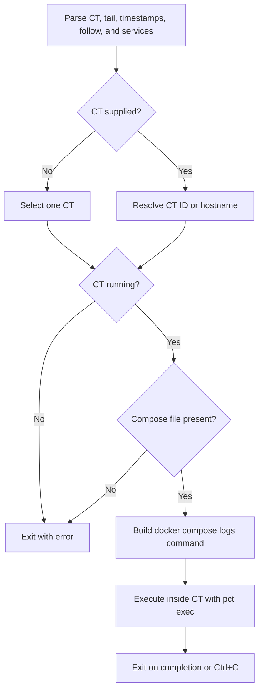

# monitorCT.sh

Streams combined Docker Compose logs from a running CT through the Proxmox host.

## Usage

```bash
./monitorCT.sh [CTID|hostname] [options]
```

| Option | Effect |
| --- | --- |
| `-n, --tail LINES` | Show the requested number of trailing lines |
| `-t, --timestamps` | Include timestamps |
| `--no-follow` | Print current logs and exit |
| `-s, --service NAME` | Filter by service; repeatable |
| `-h, --help` | Show help |

Additional positional arguments after the CT are also treated as service names.
Without a CT, the script opens an interactive single selector.

```bash
./monitorCT.sh 2100 -n 50 -t
./monitorCT.sh app.thesaints.home -s caddy -s app
./monitorCT.sh app.thesaints.home --no-follow
```

## Flow



The command runs on the Proxmox host and enters the CT itself. Do not prepend
another `pct exec`. By default logs follow until interrupted.

## Related

- [Refresh](refreshCT.md)
- [Create](createCT.md)
- [Troubleshooting](documentation/troubleshooting.md)
