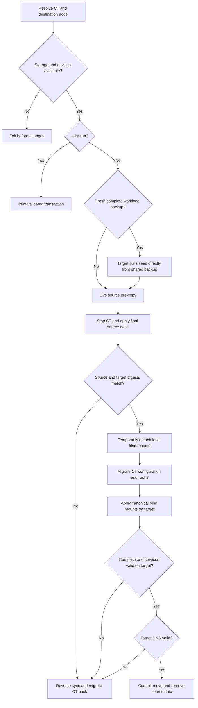

# moveCT.sh

Moves one CT between online Proxmox nodes together with its local
`/mnt/docker/<hostname>` and `/mnt/docker-data/<hostname>` trees.

## Usage

```bash
./moveCT.sh [CTID|hostname] [--node NODE] [--dry-run] [--force]
```

```bash
./moveCT.sh app.thesaints.home --node pve2 --dry-run
./moveCT.sh 2100 --node pve2
./moveCT.sh --status 2100
./moveCT.sh --resume 2100
./moveCT.sh --abort 2100
```

Each mutating move is recorded as an atomic, root-only, cluster-visible
transaction under `/etc/pve/priv/moveCT/<CTID>.json`. It records completed phases, exact bind mounts,
the original running state, and the native Proxmox migration task UPID. Only
one process can control a CT transaction at a time.

An SSH disconnect checkpoints and exits; it does not create a background
service. Use `--status` to inspect the transaction and Proxmox task, then
`--resume` to continue. Resume waits for the recorded UPID and never submits a
duplicate migration. `--abort` is explicit and refuses to act while the task
is active or ownership is ambiguous.

Local `pvesh` deliberately runs worker tasks synchronously and prints their
task output instead of returning the worker UPID. The coordinator starts that
CLI waiter separately, discovers the new native `vzmigrate` UPID from Proxmox
task history, and advances to `migration_submitted` only after persisting it.
It can therefore poll or resume the native task without mistaking task log text
for a submission response.

When the CT or destination is omitted, the script prompts for it. `--force`
skips only the final confirmation; validation still runs.

After confirmation, an interactive terminal shows a persistent ten-stage status
bar while command and transfer output scrolls above it. Progress covers target
preparation, backup seeding, both workload synchronization passes, integrity
verification, rootfs migration, service and DNS validation, and commit. The
status bar writes directly to the terminal and is not included in the
transaction log. Non-interactive invocations continue without the status bar.
Every rsync operation, including target-local backup seeding and reverse sync
during rollback, reports aggregate bytes, percentage, throughput, ETA, and
final transfer statistics in the scrolling output.

## Flow



## Validation and effects

The destination must be an online peer whose node-local `local-lvm` storage is
an active `pve/data` LVM thin pool. The CT rootfs must already use `local-lvm`;
DATA-backed rootfs volumes are outside this script's steady-state scope. Before
stopping or copying anything, the script rejects a move when the destination's
existing thin-volume commitments plus the CT rootfs would leave less than 20%
of `pve/data` free, thin-pool metadata usage is at least 80%, or the separate
Proxmox `/` filesystem has less than 20% free.

Preflight selects and runtime-validates separate source and target bridges from
each node's `entities:` policy. It previews every NIC rewrite before target
paths are created or the CT is stopped. Source drift is reconciled before the
move; after migration, every target `netN` is switched to the target selection
before the CT starts. All other NIC fields are preserved.

The target receives exactly three bind mounts: node-local IMDS at read-only
`mp0`, Docker at `mp1`, and Docker-data at `mp2`. Unrelated source `mpN` entries
are reported and deleted on successful migration. If the transaction rolls
back, the source receives its exact original mount set, including unrelated
entries. Missing IMDS health or source data is advisory; mount operations and
CT start failures remain fatal.
Preflight evaluates the source node first and then the target node; each node is
introduced by one `Contract validation '<node>'` header and checked in storage,
and capacity order without repeating the node on every line. Network-policy
output then shows both selected bridges and their match reasons.

The transaction state persists both selections and the original NIC values.
During reverse migration, the stopped CT retains its bridge that is valid on
the current node. As soon as ownership returns, rollback reconciles every NIC
to the source node's selected bridge before the CT can start. This avoids asking
the current node to validate a source-only bridge and does not rely on
version-specific migration remapping options.

Profile-aware Compose stacks are structurally validated before transaction
state is created and are stopped with every profile before the final sync.
Arbitrary `x-profiles` requirements are not executed against the offline
destination. After migration, the wrapper evaluates hardware visible inside the
running CT; rollback reevaluates on the source. Target verification uses the
selected long-running services, so variants may use different container names
while preserving a stable application alias. This permits automatic
accelerator-to-CPU fallback without persisting node or device identity.

Preflight reads the effective datacenter migration bandwidth policy. For a
finite limit it prints a lower-bound rootfs transfer estimate. An estimate over
six hours requires separate confirmation; `--force` acknowledges the warning
but never changes the cluster policy.

The script migrates rootfs with `local-lvm:local-lvm` and validates passthrough
GPU and device requirements before copying data. A Compose `/dev/dri` mapping
requires a usable destination DRM render device unless either declared
`x-profiles` fallbacks or a legacy selector render a device-free Compose model.
Fallback rendering runs inside the source CT; a stopped CT therefore fails
closed when an unavailable destination device would require fallback proof.
Broad `/dev/bus/usb` mappings are rejected because USB identity cannot be proven
across nodes. It captures the CT's original running state. When a
complete archive/workload pair no older than 26 hours is available, the target
node first copies its `docker` and `docker-data` generation directly from the
shared backup mount. This traffic flows from backup storage to the target and
does not pass through the source node. If no eligible pair is available, or the
target-side seed fails, the script resets the new target paths and falls back to
the existing source-only pre-copy.

The live source remains authoritative. After optional seeding, the script
always applies a source-to-target pre-copy while the CT runs, stops the CT, and
performs a final synchronization with deletion before comparing full tree
contents and metadata using an rsync checksum dry-run. Rootfs migration starts
only after both workload trees match; it does not run in parallel with backup
seeding.

Proxmox refuses `pct migrate` while a CT configuration contains local `mpN`
bind mounts. The script therefore records every accepted mount key and complete
value, temporarily detaches those mounts after the CT is stopped and data is
verified, migrates the rootfs, and restores the exact values on the target
before startup. Mount options are preserved rather than reconstructed from
defaults.
The ZFS `DATA` pool remains the backing store for the `DOCKER` directory storage
and `/mnt/docker`; the local-lvm-only rule applies only to the managed rootfs.

Seeding reduces source payload reads and network transfer when the backup is
recent. It does not eliminate source metadata scanning, the stopped delta, or
the final full digest reads required for correctness.

Target verification validates Compose configuration, starts the workload, and
checks services and DNS. Source data is removed only after verification commits
the move.

## Recovery

An ERR trap attempts to restore the CT to its source node, reverse-synchronize
changed data, and restore its original running state. A transaction log records
the latest run at `/root/scripts/logs/moveCT.log`. If rollback itself reports a problem, stop and inspect CT
placement and both source/target trees before retrying; do not delete either copy
manually until they are compared. Reverse migration also detaches target bind
mounts first and restores the original values on the source afterward. If
reverse synchronization, migration, or mount restoration fails, rollback keeps
the CT stopped and retains both workload copies rather than claiming success or
cleaning either side.

`SIGHUP`, `SIGINT`, and `SIGTERM` checkpoint and exit rather than initiating a
blind rollback. A Proxmox worker may remain active after its SSH client exits.
The cluster UI aggregates task visibility, but each UPID identifies the node
that executes and retains the task status and log.

For a move interrupted before checkpoint support existed, run
`--status <CT> --node <expected-target>` for a read-only report. Do not create
state or delete either workload copy until ownership, mounts, rootfs volumes,
and the latest migration task agree.

## Related

- [Refresh](refreshCT.md)
- [Backup](backupCT.md)
- [Architecture](documentation/architecture.md)
- [Troubleshooting](documentation/troubleshooting.md)
