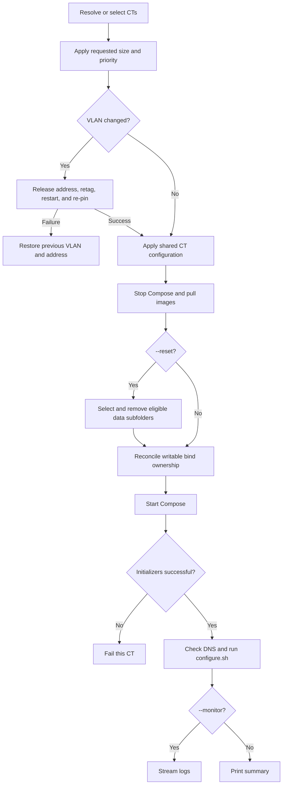

# refreshCT.sh

Before other refresh mutations, every CT NIC is idempotently reconciled to the
bridge selected by the current node's `entities:` policy. Failure is fatal for
that CT; a successful correction is retained if a later refresh step fails.

Re-applies current host, Docker, telemetry, certificate, registry, environment,
permission, and Compose configuration to one or more existing CTs.

## Usage

```bash
./refreshCT.sh [CTID|hostname] [--size S|M|L]
  [--cores N] [--memory MB] [--priority low|mid|high]
  [--vlan ID] [--monitor] [--reset]
./refreshCT.sh --all
```

Without arguments, the script opens a multi-select dialog. Options without a CT
open a single-select dialog because resize, VLAN, reset, and monitoring choices
apply to one CT. `--all` non-interactively refreshes every CT returned by the
cluster inventory through the same owner-aware batch loop. It cannot be combined
with a CT target or any single-CT option.

```bash
./refreshCT.sh app.thesaints.home
./refreshCT.sh --all
./refreshCT.sh 2100 --cores 3 --memory 3072
./refreshCT.sh 2100 --vlan 100 --monitor
./refreshCT.sh 2100 --reset
```

`--size` and custom core/memory allocation are mutually exclusive. VLAN `0`
removes a tag; omitting `--vlan` leaves networking unchanged.

## Flow



## Behavior

Resize waits up to five minutes for an active Proxmox lock. Storage health
warnings do not stop a routine refresh. Image pull failure may fall back to
cached images unless reset requires a clean reinitialization.

Before configuring the workload, refresh transactionally reconciles exactly
three bind mounts: IMDS at read-only `mp0`, Docker at `mp1`, and Docker-data at
`mp2`. Successful reconciliation removes unrelated `mpN` entries. Failure
restores the exact original mount set and running state and stops work on that
CT. IMDS availability checks are advisory; mount and restart failures are fatal.

`--reset` preserves `.env`, `docker-compose.yaml`, and underscore-prefixed
folders. Caddy data requires its own confirmation because deletion triggers
certificate reissuance. Initialization services use `restart: "no"`; every one
must exit successfully before post-deployment configuration runs.

For stacks whose Compose file starts with `x-profiles`, refresh validates the
source metadata before stopping services, synchronizes the shared resolver and
wrapper, verifies Python/PyYAML, and evaluates requirements inside the CT for
selected operations. Pull and down cover all profiles without running
requirements. Boot reevaluates selection and reconciles services with
`--remove-orphans`. Existing `_config/select-compose-profile.sh` workloads use
the same wrapper through the migration period; ordinary stacks run Compose
directly.

## Recovery

A VLAN failure attempts to restore the old tag and fixed address. For routine
failure, fix the named CT configuration, permission, Compose, initializer, DNS,
or configure error and rerun refresh. Because shared operations are idempotent,
rerunning is preferred to manual partial configuration.

## Related

- [Create](createCT.md)
- [Monitor](monitorCT.md)
- [Storage and permissions](documentation/storage-and-permissions.md)
- [Networking and authentication](documentation/networking-and-authentication.md)
- [Hardware-aware Compose profiles](documentation/hardware-compose-profiles.md)
