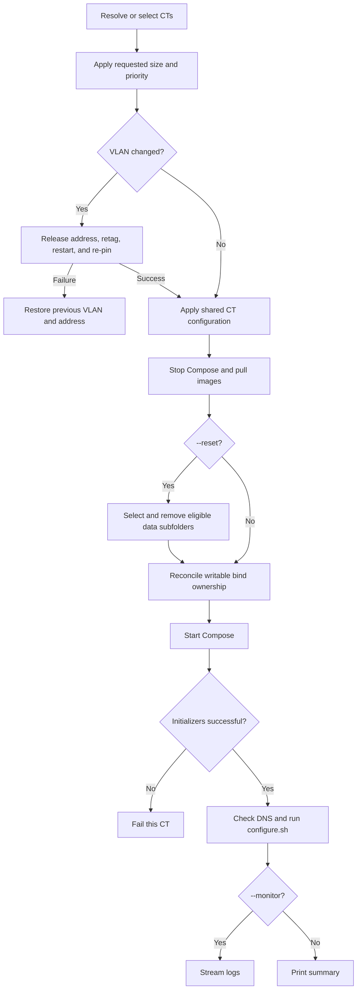

# refreshCT.sh

Before other refresh mutations, every CT NIC is idempotently reconciled to the
bridge selected by the current node's `entities:` policy. Failure is fatal for
that CT; a successful correction is retained if a later refresh step fails.

Re-applies current host, Docker, telemetry, certificate, registry, environment,
permission, and Compose configuration to one or more existing CTs.

## Usage

```bash
./refreshCT.sh [CTID|hostname] [--size S|M|L]
  [--cores N] [--memory MB] [--priority low|mid|high]
  [--vlan ID] [--monitor] [--reset]
```

Without arguments, the script opens a multi-select dialog. Options without a CT
open a single-select dialog because resize, VLAN, reset, and monitoring choices
apply to one CT.

```bash
./refreshCT.sh app.thesaints.home
./refreshCT.sh 2100 --cores 3 --memory 3072
./refreshCT.sh 2100 --vlan 100 --monitor
./refreshCT.sh 2100 --reset
```

`--size` and custom core/memory allocation are mutually exclusive. VLAN `0`
removes a tag; omitting `--vlan` leaves networking unchanged.

## Flow



## Behavior

Resize waits up to five minutes for an active Proxmox lock. Storage health
warnings do not stop a routine refresh. Image pull failure may fall back to
cached images unless reset requires a clean reinitialization.

`--reset` preserves `.env`, `docker-compose.yaml`, and underscore-prefixed
folders. Caddy data requires its own confirmation because deletion triggers
certificate reissuance. Initialization services use `restart: "no"`; every one
must exit successfully before post-deployment configuration runs.

For stacks that provide `_config/select-compose-profile.sh`, refresh synchronizes
the shared profile wrapper before Compose operations and selects current CT
hardware for validation, permission planning, startup, status, and initializer
discovery. Pull and down intentionally cover all profiles. Other CTs retain the
legacy direct Compose behavior.

## Recovery

A VLAN failure attempts to restore the old tag and fixed address. For routine
failure, fix the named CT configuration, permission, Compose, initializer, DNS,
or configure error and rerun refresh. Because shared operations are idempotent,
rerunning is preferred to manual partial configuration.

## Related

- [Create](createCT.md)
- [Monitor](monitorCT.md)
- [Storage and permissions](documentation/storage-and-permissions.md)
- [Networking and authentication](documentation/networking-and-authentication.md)
- [Hardware-aware Compose profiles](documentation/hardware-compose-profiles.md)
