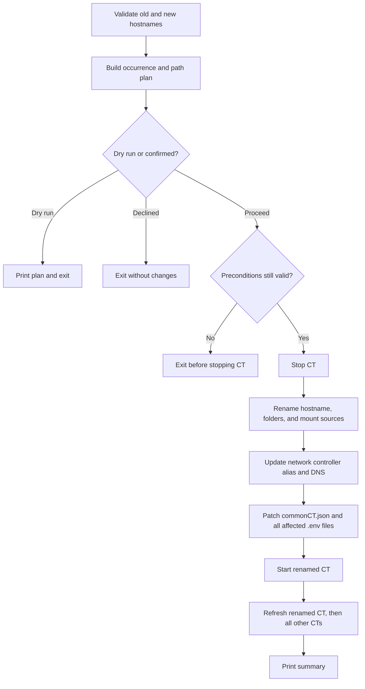

# renameCT.sh

Rename preflight selects the bridge using the unchanged CTID and requested new
hostname. Dry-run shows each affected NIC. The selected bridge is applied to
all NICs while the CT is stopped, immediately after its hostname changes.

Renames one CT end to end, including Proxmox identity, bind directories, mount
sources, network alias, shared configuration references, and per-CT environment
references.

## Usage

```bash
./renameCT.sh <old-hostname> <new-hostname> [--force] [--dry-run]
```

```bash
./renameCT.sh app.thesaints.home web.thesaints.home --dry-run
./renameCT.sh app.thesaints.home web.thesaints.home
```

Both arguments must be hostnames rather than CTIDs. `--force` skips confirmation;
`--dry-run` validates and prints every planned mutation.

## Flow



## Validation and effects

The old hostname must identify exactly one CT. The new hostname and destination
folders must not exist, and both domains must be configured. The script counts
references before mutation and rechecks preconditions immediately before
stopping the CT.

Renaming rewrites textual occurrences in `commonCT.json` and every affected
`/mnt/docker/*/.env`. Refreshing the renamed CT first reestablishes Compose,
telemetry, and TLS identity; refreshing the rest propagates shared references.
Backup workload history is renamed when present.

## Recovery

This is a coordinated sequence, not a fully automatic rollback transaction. If
it fails after the CT is stopped, use the printed phase and plan to establish
whether Proxmox hostname, bind directories, mounts, and configuration files use
the old or new name. Make those identities consistent before rerunning refresh.
Do not perform a blind global replacement.

## Related

- [Refresh](refreshCT.md)
- [Forward DNS](forwardDNSCT.md)
- [Configuration](documentation/configuration.md)
- [Networking and authentication](documentation/networking-and-authentication.md)
