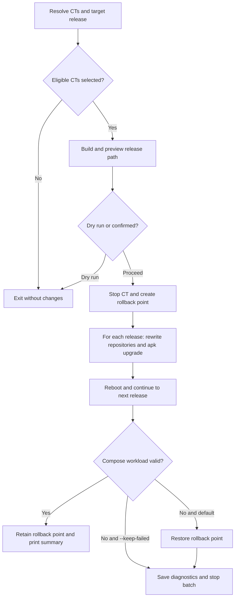

# upgradeCT.sh

Upgrade preview validates the current node's `entities:` bridge policy and
shows pending NIC changes. The real run reconciles every NIC before creating
the Alpine rollback point; later upgrade rollback does not undo that required
network correction.

Upgrades Alpine CTs one major release at a time with a stopped rootfs rollback
point and post-upgrade Docker workload verification.

## Usage

```bash
./upgradeCT.sh [CTID|hostname] [--target VERSION]
  [--dry-run] [--force] [--keep-failed]
```

```bash
./upgradeCT.sh app.thesaints.home --dry-run
./upgradeCT.sh 2100 --target 3.24
./upgradeCT.sh --target 3.24
```

Without a CT, the script offers a multi-select list of Alpine CTs older than the
target. The default target is the newest Alpine 3.x release advertised by
`pveam`. Selected CTs are upgraded serially.

## Flow



## Safety and effects

The script verifies the current Alpine release and computes every intermediate
release. Before changing repositories, it stops the CT and creates either a ZFS
or Proxmox snapshot rollback point. It upgrades packages and reboots for each
release, then validates and starts the Compose workload.

Successful rollback points are intentionally retained for operator-controlled
cleanup. The first failed CT stops a batch. `--keep-failed` suppresses automatic
rollback for diagnosis and should be used only when the failed state itself is
needed.

## Recovery

By default, a failure restores the pre-upgrade rootfs and captures diagnostics.
Diagnostics are appended to the latest-run log at
`/root/scripts/logs/upgradeCT.log`. Review that log and the retained snapshot before retrying. When
`--keep-failed` was used, manually choose between repairing the CT and restoring
the reported rollback point; do not begin another upgrade while the release is
partially transitioned.

## Related

- [Refresh](refreshCT.md)
- [Backup](backupCT.md)
- [Testing](documentation/testing.md)
- [Troubleshooting](documentation/troubleshooting.md)
